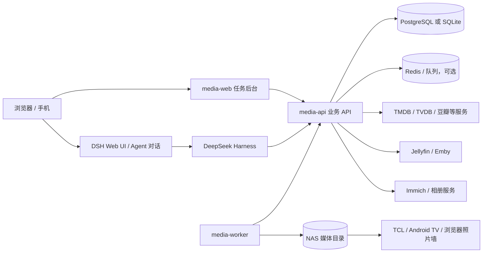

# DeepSeek Harness 驱动的家用 NAS 媒体自动化平台方案可行性分析

> 文档归属：架构研究（可行性评估），不是已接受的架构决策。
> 来源：用户于 2026-09-14 提供的 DSH 调研稿；下文新增“MediaFlow 当前项目适配分析”由本次工作依据仓库现状补充。
> 证据边界：项目状态以当前 `main` 工作树的源码、OpenSpec living specs、README 和文档为准；真实 NAS、DSH、电视端和跨服务运行结果未在本次工作中执行。

## 0. MediaFlow 当前项目适配分析

### 当前基线

MediaFlow 当前仍是本地优先、自托管的模块化单体：一个 Core 进程提供 API、持久任务和文件操作，SQLite 保存业务状态，Vue Web 通过 REST/SSE 访问。当前仓库已经有收件目录、连续发现、确定性识别、人工审核、规则约束整理、文件操作 journal、Catalog、下载器管理、RSS/Webhook 自动化和默认关闭的 Ollama 识别增强；这些能力分别由当前 `openspec/specs/`、`apps/core/README.md`、`apps/web/README.md` 和契约测试维护。

当前边界仍然是：MVP 影视整理以确定性路径为基础；本地模型只能作为可关闭、可回退的增强；不引入动态插件运行时，不让外部工作流平台成为核心依赖，不把 Jellyfin 刷新或媒体库映射作为本地整理成功条件；照片、图书和漫画保留为后续资源类型方向，尚未成为当前产品闭环。

### 与本报告一致的部分

- DSH 只做会话、意图理解、候选解释、工具编排和人工交互，业务数据库、任务状态、文件操作和回滚仍由 MediaFlow 持有，这与现有 `catalog`、`tasks`、`organization`、`connectors` 模块边界一致。
- 业务任务必须跨重启恢复，不能把 DSH Job 或 Session 当作业务事实来源；这与现有持久任务、outbox、SSE 和 file journal 设计一致。
- 模型输出只能作为带来源的候选证据，不能绕过路径能力、计划预演、冲突检查、幂等和审计；这与当前 M3 安全整理和 M4 Ollama enhancer 规格一致。
- DSH 若接入，应通过稳定的进程外 API 或受控 connector 访问 MediaFlow，而不是读取 SQLite、挂载任意 NAS 路径或直接执行 `mv`/`rm`。

### 与当前项目冲突或需要降级的部分

- 报告推荐拆成 `media-api`、`media-worker`、数据库、队列和独立 Web；当前 MediaFlow 的已确认方向是模块化单体和 SQLite，首版不提前微服务化或引入 Redis/独立队列。拆分只能作为真实吞吐、隔离或部署需求出现后的候选演进。
- 报告把 Jellyfin/Emby 刷新列入媒体闭环；当前 MediaFlow 明确把 Jellyfin 保持为独立连接健康与入口，本地整理不依赖刷新、可见性或媒体库映射。若未来改变这一边界，必须单独更新产品、架构和验收定义。
- 报告的相册备份、去重、精选相册和电视照片墙属于未来资源类型与外部消费场景。当前产品定义明确不建设照片能力，且既有 NAS/电视研究要求真实型号、固件、容器和客户端实机验证，不能把报告中的照片工作流当成已实现范围。
- 报告假设 DSH 可承担通用插件、Web UI 和任务编排；当前架构决策只接受编译期内置、类型化连接器，M4 本地模型也必须默认关闭并回退，尚未批准 DSH 插件 ABI、外部 provider SDK 或动态脚本运行时。

### 当前结论

本报告对 MediaFlow 的结论是“方向可行、当前不接入”。先保持 MediaFlow Core 的任务、计划、文件安全、Catalog 和 API 为权威事实源；DSH 只作为未来可替换的进程外智能编排层候选。当前优先级仍是既有 M3/M4 闭环、部署/备份/升级和真实 NAS 验收，不是另起一套 `media-api`/`media-worker` 平台。

最小后续验证顺序：

1. 在不改变当前 Core 行为的隔离环境中，用一个只读测试目录验证 DSH connector 能否调用现有任务查询、候选查询和计划预览 API。
2. 验证 DSH Session 与 MediaFlow `task_id` 的关联只保存引用和脱敏摘要，不复制媒体文件、NFO、凭据或完整路径。
3. 通过失败注入验证 DSH 不可用、超时、输出无效或版本升级时，M3/M4 确定性路径仍可独立运行。
4. 只有当上述验证和真实 NAS 部署证据成立后，才评估是否需要独立 worker、队列、照片能力或正式 DSH 架构决策。

本节是对当前项目的分析，不修改既有产品范围、路线图或架构决策；原调研正文从下一节开始保留。

## 1. 执行结论

基于 DeepSeek Harness（DSH）搭建影视刮削、相册整理、媒体库同步和家庭照片墙任务后台是可行的，推荐结论为“**有条件通过，采用业务后台与 DSH 分离部署**”。

DSH 适合承担 Agent 对话、自然语言意图理解、工具调用、任务编排、人工审批、异常解释、会话审计和多模型接入。影视与相册系统的长期事实——媒体索引、照片元数据、任务进度、重试、回滚、用户偏好和设备配置——应由独立的业务后台和数据库持有。

这种拆分能让 DSH 独立升级，避免 DSH 的开发者预览状态、插件 API 变化或 Session 格式变化直接影响媒体库核心数据。

## 2. 分析范围与假设

本报告覆盖以下家用 NAS 场景：

- 视频文件导入、影视刮削、重命名、NFO/海报生成和 Jellyfin/Emby 刷新。
- 手机、相机照片自动备份、EXIF 读取、重复检测、相似照片聚类、相册建议和精选照片展示。
- NAS 文件变更触发、定时扫描、失败重试、人工确认和执行审计。
- Web 任务后台、DSH Agent 对话、CLI/headless 和 Python SDK 接入。

网络假设沿用常见家庭结构：运营商光猫或主路由、已有有线 AP、NAS 与电脑位于家庭局域网，NAS 通过 Docker 或原生服务运行媒体应用。若现有环境仍是 TP-LINK R479 类千兆网关、预埋网线和绿联 NAS，应优先复用现有有线链路；大文件转移速度受 NAS 网卡、交换机、上联链路和客户端共同限制，不能只看 Wi-Fi 标称速率。

## 3. DSH 能力与媒体业务需求的匹配

| 媒体需求 | DSH 可复用能力 | 仍需自建的部分 | 结论 |
|---|---|---|---|
| 扫描 NAS 文件 | 文件系统、Shell、后台 Job | 稳定的扫描器、增量游标、文件锁 | 可行 |
| 影视元数据查询 | Tool、Web 访问、模型适配器 | TMDB/TVDB 等适配、缓存、限流、授权 | 可行 |
| 片名和季集匹配 | Agent、工作流、人工提问 | 确定性解析规则、置信度算法 | 很适合 |
| 重命名和 NFO 写入 | Tool、审批、权限策略 | 原子移动、回滚、幂等、冲突处理 | 可行，但必须受控 |
| 相册去重 | Tool、后台 Job | SHA/感知哈希、EXIF、缩略图、索引 | 适合编排，不适合全交给模型 |
| 图片标签与精选 | 图片输入、Agent、外部视觉模型 | 人脸/向量库、隐私策略、人工校正 | 可行，需控制成本 |
| 长任务进度 | `ctx.jobs`、workflow | 业务任务表、断点恢复、历史查询 | 必须分离 |
| 可视化任务后台 | DSH Host/Client/Slots | 业务页面、任务模型、审批页面 | 可行，独立前端更稳 |
| NAS/Immich/Jellyfin 同步 | 自定义 Tool、HTTP API、Webhook | 各服务适配和版本兼容 | 可行 |
| 独立升级 | profile、bundle、patch、SDK | 稳定的业务 API 契约 | 强烈建议 |

DSH 官方包按 core、jobs、workflow、webhook、filesystem、session、SDK、Host/Client UI 等能力分组，具备搭建这些连接层的基础。[Packages 总览](https://github.com/deepseek-ai/deepseek-harness/blob/master/packages/README.md)

## 4. 推荐目标架构



### 4.1 DSH 服务

DSH 单独运行，负责：

- Agent 会话和自然语言交互。
- 影视匹配、相册整理、异常分析等模型任务。
- 自定义工具和 workflow。
- 人工审批请求。
- Agent Session、工具调用和推理过程记录。
- 模型提供方、凭据引用和 profile 配置。

DSH 可以通过一个自定义插件调用 `media-api`，不要直接访问媒体数据库。

### 4.2 业务 API

`media-api` 是媒体平台的权威服务，负责：

- 媒体库、相册和设备配置。
- 任务、任务项、步骤和状态机。
- 任务权限、幂等键和并发控制。
- 候选元数据及用户选择。
- 操作计划、执行记录和回滚记录。
- 向前端发布可靠的 baseline 与增量事件。
- 保存 `task_id` 与 `session_id` 的关联。

### 4.3 Worker

`media-worker` 只负责确定性的重活：

- 遍历目录和读取文件信息。
- EXIF、哈希、感知哈希和缩略图处理。
- 调用元数据接口并缓存结果。
- 文件重命名、移动、写 NFO 或 sidecar。
- 调用 Jellyfin、Emby、Immich 刷新接口。
- 执行重试和限流。

Worker 应只挂载必要的 NAS 目录；DSH 通过业务 API 间接请求它。

## 5. 数据归属与存储设计

### 5.1 DSH 持有的数据

DSH 的 Session 适合记录：

- 用户自然语言请求。
- Agent 的计划和解释。
- 工具调用及返回结果摘要。
- 人工审批过程。
- Agent 与子 Agent 的协作关系。
- 与业务任务关联的 `task_id`。

DSH 的 Session 是追加式事件日志，可通过 JSONL persistence provider 持久化和恢复。[会话持久化](https://deepseek-harness.github.io/deepseek-harness/reference/subsystems/persistence)

### 5.2 业务后台持有的数据

业务后台必须保存：

```text
media_asset
  id, kind, source_path, size, checksum, media_hash

media_metadata
  asset_id, provider, provider_id, title, year, season, episode, payload

media_task
  id, type, status, session_id, idempotency_key, created_at, updated_at

media_task_item
  task_id, asset_id, status, confidence, candidate_json, selected_json, error

media_operation
  task_id, source_path, target_path, operation, reversible, applied_at
```

原始照片、原始视频、海报和缩略图不应放在 DSH Session 中。它们应放在 NAS 或对象存储；数据库保存路径、哈希、元数据和关系。

### 5.3 为什么不能只用 DSH Job

DSH Job 适合当前进程中正在运行的后台工作；媒体业务需要跨重启、跨版本和跨 worker 恢复。因此 `ctx.jobs` 只能作为执行句柄，不能作为影视或相册任务的唯一事实来源。[Jobs 文档](https://deepseek-harness.github.io/deepseek-harness/reference/subsystems/jobs)

## 6. 业务任务状态机

影视任务建议：

```text
queued
  → scanning
  → matching
  → waiting_approval
  → applying
  → syncing
  → succeeded
```

异常分支：

```text
matching → retryable
applying → failed
任何阶段 → canceled
```

相册任务建议：

```text
queued
  → importing
  → extracting_metadata
  → detecting_duplicates
  → classifying
  → waiting_approval
  → writing_album
  → succeeded
```

每个状态必须能回答：

- 处理了多少个文件。
- 当前处理的是哪个文件。
- 使用了哪个元数据源或模型。
- 是否需要人工确认。
- 是否可以安全重试。
- 是否已经修改了文件。
- 是否可以回滚。

## 7. 可视化后台设计

### 7.1 总览页

展示运行中、待审批、失败、已完成和最近触发的任务。

```text
运行中       3
等待确认     12
失败待重试   4
今日完成   168
```

任务表建议包含：任务类型、来源目录、触发方式、状态、进度、最近错误、关联 Session 和操作按钮。

### 7.2 任务详情页

按步骤显示：

```text
扫描目录       143 / 143
匹配元数据      140 / 143
等待确认          3
写入 NFO          0 / 140
刷新媒体库       未开始
```

每一步都展示输入、输出、耗时、错误、重试次数和相关文件。

### 7.3 审批中心

影视匹配示例：

```text
The.Last.of.Us.S01E03.mkv

候选 A：最后生还者 / 第 1 季 / 第 3 集 / 96%
候选 B：The Last of Us / Season 1 / Episode 3 / 91%

[采用 A] [采用 B] [编辑] [跳过]
```

相册整理示例：

```text
发现 18 组相似照片

[保留左图] [保留右图] [全部保留] [跳过]
```

### 7.4 结果与回滚

每次写入或移动都保存原路径、目标路径、任务 ID、时间、操作者、元数据来源和同步结果。第一版必须支持 dry-run 和“撤销本次任务”。

### 7.5 实时更新

业务后台应发布：

```text
task.created
task.started
task.progress
task.item.updated
task.approval.required
task.failed
task.completed
```

前端首次连接获取完整快照，之后接收增量事件；重连时按版本或 cursor 恢复。DSH Web Client 也采用 Host 权威状态、Remote stream、Client model 和增量更新的模式。[Web Client 架构](https://deepseek-harness.github.io/deepseek-harness/reference/subsystems/web-client)

## 8. DSH 与业务后台的接口

建议先定义稳定的 HTTP API：

```text
POST /api/tasks
GET  /api/tasks/:id
POST /api/tasks/:id/plan
POST /api/tasks/:id/approve
POST /api/tasks/:id/retry
POST /api/tasks/:id/cancel
GET  /api/tasks/:id/events
GET  /api/assets/:id/candidates
```

DSH 工具只暴露业务动作：

```text
media_scan
media_match_candidates
media_create_plan
media_request_approval
media_apply_plan
media_task_status
media_retry
media_cancel
```

模型不应直接获得数据库凭据或任意 `rm`、`mv` 权限。真正的写操作由业务 API 校验审批状态、路径范围、冲突和幂等键。

## 9. 家用 NAS 场景落地

### 9.1 影视库

```text
下载/复制完成
  → NAS 文件事件或定时扫描
  → media-api 创建任务
  → worker 解析文件名
  → DSH 处理模糊匹配
  → 用户审批低置信度项
  → worker 重命名和写 NFO
  → Jellyfin/Emby 刷新
```

第一版只处理“扫描—候选—审批—重命名—NFO”，暂不自动删除源文件。

### 9.2 相册备份与精选展示

应拆成两个工作流：

```text
全量备份：手机/相机 → NAS 原图库
精选展示：原图库 → 精选相册 → TV/照片墙
```

不能把“自动上传的全部照片”直接作为电视照片墙数据源。若使用 Immich 或类似服务，原图库与“TV 精选”相册分开；电视端只访问精选集合。16:9 铺满与完整保留无法同时完全满足：`cover` 会裁剪，`contain` 会留边，可用模糊背景改善观感。具体 TCL 型号、固件、浏览器和 NAS Docker 支持仍需实机验证。

### 9.3 网络与权限

如果沿用现有家庭有线网络：

- NAS 与 worker 尽量接同一交换机或同一局域网。
- 电脑房增加交换机时，实际端口按“1 个上联 + 设备数 + 备用口”计算。
- 千兆网关不会让 2.5G NAS 获得跨房间 2.5G 速度。
- NAS 固定 IP、DNS、网关和反向代理地址应纳入部署清单。
- 仅向 worker 暴露媒体目录，DSH 和浏览器只访问业务 API。

## 10. 独立部署方案

### 推荐的 Docker Compose 形态

```text
media-web
media-api
media-worker
media-db
media-queue          # 第一版可省略
reverse-proxy

独立部署：dsh-web / dsh-sdk
```

DSH 通过环境变量访问：

```text
MEDIA_API_BASE_URL=http://media-api:8080
MEDIA_API_TOKEN=...
```

业务 API 需要版本化，例如 `/api/v1`。DSH 插件只依赖 API schema，不依赖业务数据库表结构。

### 升级边界

升级 DSH 时保留：

- `$DSH_HOME`
- DSH profile 和 patch
- Session 存储目录
- DSH 插件版本锁定

升级媒体后台时保留：

- 数据库卷
- NAS 数据卷
- 任务队列
- API 迁移脚本

DSH 可以停机升级，媒体后台继续保存任务；重新连接后，Agent 根据 `task_id` 和业务状态继续工作。

## 11. 分阶段实施

### Phase 0：验证闭环

目标：不改变文件，只生成报告。

- 连接一个测试目录。
- 扫描视频或照片。
- 写入候选元数据。
- 显示任务进度。
- 验证 DSH Session 与 `task_id` 关联。

验收：100 个文件扫描结果可重复，任务重启后仍可查询。

### Phase 1：影视整理 MVP

- 文件名解析。
- 元数据候选。
- dry-run 计划。
- 人工审批。
- 原子重命名。
- NFO 生成。
- Jellyfin/Emby 刷新。
- 失败重试和回滚。

### Phase 2：相册整理 MVP

- EXIF 提取。
- SHA/感知哈希去重。
- 相似照片分组。
- 精选相册建议。
- 用户确认后写入 sidecar 或相册服务。
- 原图只读保护。

### Phase 3：自动触发和多设备

- NAS 文件变更触发。
- 定时扫描。
- 手机导入目录。
- 多个媒体根目录。
- 多个 Jellyfin/Immich 实例。
- 独立 worker 和并发限制。

## 12. 验收指标

### 数据正确性

- 文件不会被无审批删除。
- 重复提交同一任务不会重复移动文件。
- 重启后任务状态和进度可恢复。
- 所有已修改文件都有原路径和回滚记录。
- 原图 checksum 在整理前后保持一致。

### 任务可靠性

- 网络错误可重试。
- 单个文件失败不拖垮整批任务。
- worker 崩溃后任务进入 `retryable` 或 `failed`。
- 任务取消能停止后续操作。
- 队列并发有上限。

### UI 可用性

- 任务列表可按状态、类型、时间和来源筛选。
- 任务详情能定位到具体文件。
- 待审批项能在三次点击内完成。
- 浏览器断线重连后进度不倒退。
- DSH Session 与业务任务可以互相跳转。

### NAS 真实验证

- 在真实 NAS 上完成至少一批影视和照片任务。
- 验证中文文件名、特殊字符、长路径和重复文件。
- 验证 SMB 权限、NAS 回收站和磁盘空间不足。
- 验证 Jellyfin/Immich 实际刷新。
- 验证电视端只显示“TV 精选”集合，不混入全量备份。

## 13. 主要风险与应对

| 风险 | 影响 | 应对 |
|---|---|---|
| DSH developer preview 破坏兼容 | Agent 插件升级失败 | 固定版本、独立容器、API 解耦 |
| 模型误匹配 | 错误重命名或错误标签 | 置信度阈值、dry-run、人工审批 |
| 直接删除或移动文件 | 数据损失 | 默认只读、回收站、原子操作、回滚 |
| 元数据 API 限流或变更 | 大批量任务失败 | 缓存、退避、来源适配器、人工补录 |
| NAS 网络抖动 | 任务中断 | 断点续作、校验和、幂等键 |
| 图片隐私泄露 | 个人数据风险 | 本地模型优先、最小凭据、隔离网络 |
| DSH 沙箱误以为绝对安全 | 主机或凭据泄露 | 容器/独立账户/最小挂载，不能只依赖沙箱 |
| TV 浏览器能力不足 | 照片墙体验差 | 先验证实机，再选择原生客户端或 Immich Kiosk |

DSH 官方安全说明明确指出，项目尚未完成安全审计，模型和第三方插件可能访问命令、文件、网络和凭据；沙箱和审批只能降低风险，不能替代隔离环境。[安全说明](https://github.com/deepseek-ai/deepseek-harness/blob/master/SAFETY.zh.md)

## 14. 最终建议

建议采用以下最小组合：

```text
独立 media-api
独立 media-worker
SQLite 或 PostgreSQL
独立 media-web 任务后台
独立 DSH Web/SDK
一个 dsh-media connector 插件
NAS 原图/视频存储
```

第一阶段先做影视整理，因为文件名、元数据和审批链比相册视觉分类更容易验证。相册整理从“重复检测报告”和“精选相册建议”开始，不做自动删除。

最终系统的职责边界应保持为：

```text
DSH Session：Agent 做了什么、为什么这么判断
Media Task：业务任务做到哪一步、能否恢复
Media DB：有哪些媒体、相册和元数据
NAS：原始文件和生成工件
```

结论：**方案技术上可行，且独立部署是正确方向；推荐先把 DSH 当作可替换的智能编排层，业务后台和 NAS 数据面保持稳定、独立和可回滚。**

## 14.1 MediaFlow 交接与证据边界

- 当前实现证据：以 `openspec/specs/`、Core/Web README、契约和实际检查命令为准。
- 当前规划证据：以 `docs/product/`、`docs/architecture/` 和 `docs/plans/roadmap.md` 为准。
- 当前部署证据：NAS 文档门禁不等于 UGOS Pro 目标机验收；照片墙和电视端也需要单独的设备证据。
- 当前 Git 状态：本研究只新增文档与 OpenSpec 定义产物，不提交、不推送；StudySpace 根目录已有的 CreaLoom catalog 修改与本研究无关，保留不动。

## 15. 参考资料

1. [DeepSeek Harness 中文 README](https://github.com/deepseek-ai/deepseek-harness/blob/master/README.zh.md)
2. [DeepSeek Harness 架构](https://deepseek-harness.github.io/deepseek-harness/reference/)
3. [Packages 能力地图](https://github.com/deepseek-ai/deepseek-harness/blob/master/packages/README.md)
4. [Web Client 架构](https://deepseek-harness.github.io/deepseek-harness/reference/subsystems/web-client)
5. [会话持久化](https://deepseek-harness.github.io/deepseek-harness/reference/subsystems/persistence)
6. [后台任务运行时](https://deepseek-harness.github.io/deepseek-harness/reference/subsystems/jobs)
7. [工作流](https://deepseek-harness.github.io/deepseek-harness/reference/subsystems/workflow)
8. [Python SDK](https://deepseek-harness.github.io/deepseek-harness/guide/python-sdk)
9. [安全说明](https://github.com/deepseek-ai/deepseek-harness/blob/master/SAFETY.zh.md)
10. [Immich 移动端备份](https://docs.immich.app/features/mobile-backup/)
11. [Immich Kiosk](https://docs.immichkiosk.app/)
