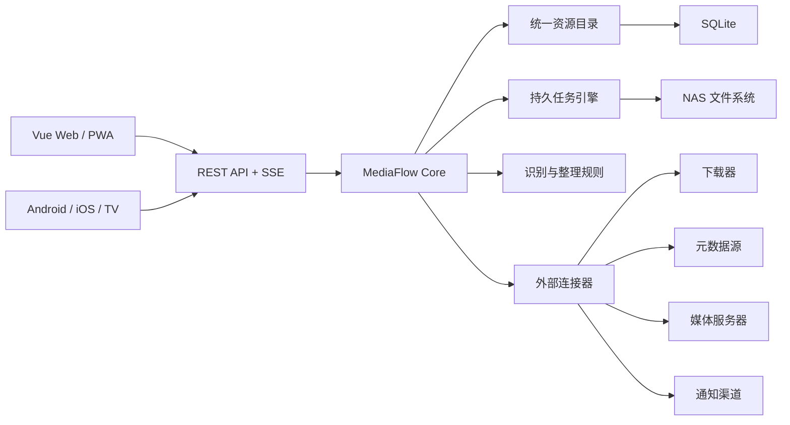

# MediaFlow 产品形态与技术选型设计

> 日期：2026-07-10
> 状态：产品与交互基线已于 M1.5 完成整体确认
> M1.5 边界同步：2026-07-16
> M1.6 架构细化：见 [MVP 架构基线](../architecture/mvp-architecture-baseline.md)
> 适用范围：产品定义、系统边界、总体架构、客户端路线、技术选型与后续扩展

## 0. 决策摘要

MediaFlow 定义为运行在家庭 NAS 上的本地数字资源中枢。它负责发现、识别、整理、建立媒体记录和分发家庭数字资源，并提供统一浏览入口，但不承担媒体播放和转码。

已经确认的关键决策：

1. 产品采用本地优先、自托管模式，所有业务数据默认留在用户 NAS。
2. 首阶段把影视自动化做深，统一资源模型保留照片、图书、漫画等扩展能力。
3. MVP 自动化从专用收件目录开始；下载器、RSS、Webhook 和下载完成监控在后续阶段接入，不内置站点聚合。
4. 不使用 n8n 或 Dify，不把外部编排平台作为核心运行依赖。
5. 不自研播放器和转码器，播放交给 Jellyfin、Emby、Plex、Infuse 等外部产品。
6. Desktop 原生客户端暂不建设，桌面用户使用响应式 Web/PWA。
7. 正式 Web 使用 Vue；移动端共享 KMP 业务逻辑，Android 使用 Jetpack Compose，iOS 使用 SwiftUI。
8. Compose Multiplatform UI 和 Flutter 作为学习与技术验证客户端，不与正式原生客户端保持长期全量功能等价。

## 1. 产品定位

### 1.1 一句话定位

MediaFlow 是面向家庭 NAS 的本地数字资源中枢：用 MoviePilot 式自动化管理资源生命周期，用 Infuse 式信息组织改善浏览体验，再把播放交给用户现有的媒体服务器和播放器。

### 1.2 目标用户

- 家庭 NAS 管理者：配置资源库、下载器、整理规则、媒体服务器、用户和系统运行参数。
- 家庭媒体维护者：处理低置信度识别、整理冲突和失败任务。
- 家庭成员：后续通过 MediaFlow 浏览媒体、查看详情、接收状态通知并跳转外部播放器。

MVP 阶段只为同一个家庭管理维护者提供 MediaFlow 账号和界面，家庭成员直接使用 Jellyfin；家庭成员角色和消费入口在后续阶段增加。详细用户假设、核心问题、成功标准和统一领域语言见 [MVP 用户、问题与领域语言](mvp-user-problem-domain-language.md)。

### 1.3 产品边界

MediaFlow 负责：

- 资源库和目录管理。
- 下载器连接、下载任务查看和手动添加。
- 文件扫描、增量监听和下载完成接管。
- 本地文件名识别、NFO 复用和 TMDB 元数据补全。
- 低置信度人工确认。
- 整理预演、执行、冲突处理、NFO 写入和回滚。
- Jellyfin、Emby、Plex 等外部媒体服务器的连接健康与全局入口；媒体库刷新、资源关联和深度跳转待其开放能力明确后另行规划。
- 持久任务、通知、日志、审计、备份和诊断。
- 统一媒体墙、详情页和跨设备浏览体验。

MediaFlow 不负责：

- 视频播放、转码、播放进度主数据和字幕渲染。
- 私有站点 Cookie、资源聚合搜索和站点适配。
- 官方云端账号、云端控制面和用户媒体数据托管。
- 依赖 n8n、Dify 或其他外部工作流产品才能运行的核心流程。

## 2. 产品功能域

正式 Web 包含以下一级功能域：

1. 概览：媒体统计、磁盘状态、下载进度、待确认项目和近期任务。
2. 资源库：电影、剧集、动漫的媒体墙、列表、搜索、筛选和详情。
3. 收件箱：新发现、识别失败、低置信度和冲突项目的人工处理。
4. 整理中心：规则配置、目标路径预览、批量执行、冲突处理和回滚。
5. 下载管理：手动添加、RSS、Webhook、下载器连接和任务监控。
6. 任务中心：扫描、识别、刮削、整理和通知任务的进度、日志与重试。
7. 连接中心：qBittorrent、Transmission、TMDB、Jellyfin、Emby、Plex 和通知渠道。
8. 系统管理：资源库、用户、权限、配置、备份、审计、诊断和升级。

标准自动化流程：

```text
专用收件目录或后续下载完成事件
  -> 发现文件
  -> 安全路径检查
  -> 本地识别与 NFO 复用
  -> 元数据补全
  -> 置信度判断
  -> 人工确认或自动生成整理计划
  -> 预演
  -> 原子执行与 NFO 写入
  -> 建立媒体记录
  -> 通知
  -> 媒体墙展示
```

外部媒体服务器是否监控整理目标目录由用户在对应服务中独立配置，不属于 MediaFlow 整理任务的阶段或成功条件。

## 3. 总体架构

采用本地优先的模块化单体。一个 MediaFlow Core 进程提供 API、持久任务和文件操作，降低家庭 NAS 的部署与运维成本。



Core 内部模块：

- `catalog`：资源库、逻辑媒体、文件版本、元数据和封面。
- `discovery`：目录扫描、文件监听、下载完成事件和增量对账。
- `identification`：文件名解析、NFO 复用、元数据匹配和置信度。
- `organization`：规则计算、预演、执行 journal、冲突处理和回滚。
- `tasks`：持久队列、进度、取消、重试、租约和崩溃恢复。
- `connectors`：下载器、媒体服务器、元数据源和通知适配器。
- `identity`：本地用户、角色、设备令牌和会话。
- `admin`：配置、备份、升级、日志、审计和健康诊断。

## 4. 数据模型

逻辑媒体与物理文件必须分离，避免现有单一资源条目无法表达多版本、剧集和文件迁移。

- `Library`：受管理的资源库及根目录。
- `MediaEntity`：逻辑电影、剧集、季度或单集。
- `FileAsset`：实际文件、相对路径、大小、时间、指纹和技术参数。
- `MediaVersion`：同一媒体的 1080p、4K、导演剪辑版等版本。
- `MetadataRecord`：来自 parser、NFO、TMDB 或人工修改的字段及优先级。
- `Artwork`：海报、背景图、缩略图、本地缓存和来源。
- `OrganizationPlan`：整理前快照、目标路径、操作列表和冲突决策。
- `Task` 与 `TaskEvent`：任务状态、阶段进度、错误和结果。
- `Integration`：连接器类型、能力、健康状态和加密配置。
- `AuditEvent`：配置变更、文件操作和管理行为审计。

## 5. 服务端技术选型

### 5.1 核心栈

- Rust 1.90 或更高版本，Edition 2024。
- Axum 0.8、Tokio、Hyper、Tower 和 tower-http。
- SQLx 0.8 与 SQLite，启用 WAL、外键、FTS5 和显式事务。
- Serde、utoipa/OpenAPI、tracing 和 OpenTelemetry。
- reqwest 负责外部 HTTP 连接。
- notify 负责文件系统事件，目录扫描使用有界并行遍历。
- BLAKE3 负责快速文件指纹，完整哈希仅在必要时计算。
- cap-std 或等价能力目录封装负责路径安全边界。
- ffprobe 作为独立进程提取媒体技术参数。

### 5.2 任务模型

- 任务必须先写 SQLite 再进入 Tokio Worker。
- 每个任务使用明确阶段、进度、取消令牌、重试策略和执行租约。
- 文件操作生成持久 journal，执行幂等并支持回滚。
- 外部服务调用统一使用超时、指数退避和熔断。
- 单文件失败不终止整库任务，任务结果必须包含错误明细。
- 首版不引入 Redis、RabbitMQ、Kafka 或独立工作流服务。

### 5.3 API

- REST/JSON 作为全部客户端的稳定协议。
- OpenAPI 是客户端契约的唯一事实来源。
- SSE 推送任务、下载和系统状态的增量事件。
- Webhook 接收下载完成和外部自动化触发。
- API 使用 `/api/v1` 版本前缀，破坏性变更通过新版本演进。

## 6. Web/PWA 技术选型

正式 Web 使用：

- Vue 3、TypeScript Strict、Composition API 和 `<script setup>`。
- Vite 8、Rolldown 和 pnpm。
- Vue Router 负责路由、权限守卫和懒加载。
- TanStack Vue Query 管理服务端状态、缓存、失效和重试。
- Pinia 仅管理会话、用户偏好和短生命周期客户端状态。
- TanStack Virtual 与服务端分页负责媒体墙、任务和日志大列表。
- TanStack Table 负责可组合数据表格。
- Reka UI、Tailwind CSS 4 和 Lucide Vue 构建设计系统。
- VeeValidate 与 Zod 负责复杂配置表单。
- ECharts 按页面动态加载。
- `openapi-typescript` 与 `openapi-fetch` 生成类型化 API 客户端。
- Vitest、Vue Test Utils 和 Playwright 负责测试。
- PWA 只缓存应用壳与静态资源，不缓存敏感 API 响应。

不采用 Nuxt SSR。MediaFlow 是 NAS 上的认证后管理应用，没有 SEO 需求，Rust Core 已承担服务端职责。

不将 Vuetify 作为默认设计系统。Reka UI 与 Tailwind 更适合定制媒体墙和密集管理界面，并能减少无关组件与样式负担。

## 7. Android、iOS 与 TV

### 7.1 KMP Shared SDK

Android 与 iOS 共享业务 SDK，但不共享正式 UI。共享范围：

- Ktor Client 3.5+ 网络层、认证、重试、分页和 SSE。
- kotlinx.serialization DTO 与领域模型。
- Repository、UseCase、错误映射和任务状态机。
- SQLDelight 2.3+ 本地缓存、迁移和类型化查询。
- 识别确认、整理计划和连接状态等纯业务规则。

不共享：

- UI、导航、生命周期和页面 ViewModel。
- 图片加载、推送通知、深链接和焦点系统。
- Keychain、Keystore 和平台权限实现。

Android 使用 Kotlin、Jetpack Compose、Material 3 Adaptive、Android ViewModel、Coil 和平台安全存储。

iOS 使用 Swift 6、SwiftUI、Observation、Swift Concurrency、URLSession 互操作层和 Keychain。KMP 通过 XCFramework 接入，并由薄 Swift Facade 将共享接口转换为 Swift 友好的 async、AsyncSequence 和不可变快照。

Swift Export 在 2026 年仍为 Alpha，不作为首版生产依赖。开发期使用 Xcode Direct Integration，发布时生成版本化 XCFramework 或 SwiftPM 二进制包。

### 7.2 TV

- Android TV 使用独立 Compose for TV 应用与遥控器焦点模型。
- tvOS 使用独立 SwiftUI 应用与 Focus Engine。
- TV 只提供媒体墙、详情、系统状态和外部播放器跳转，不提供复杂管理。
- Android TV 可复用 KMP Android 目标的共享 SDK。
- tvOS 的 KMP 复用作为可选能力；tvOS 目标成熟度不得阻塞正式 tvOS 客户端。

## 8. 多 UI 学习与实践轨道

UI 方案以构建目标切换，不在同一安装包中运行时切换渲染引擎。

1. 原生正式轨道：Android Compose 与 iOS SwiftUI，保持完整产品能力。
2. Compose Multiplatform 实验轨道：Android/iOS 各实现一个完整垂直切片，直接消费 KMP Shared SDK。
3. Flutter 实验轨道：Android/iOS 各实现相同垂直切片，通过 Dart OpenAPI SDK 连接 Core。

Flutter 实验轨道不强制桥接 KMP。业务一致性通过 OpenAPI、统一 fixtures、页面状态规范和端到端场景保证。

Flutter 可附带 Web 实验，但不替代 Vue 正式 Web；tvOS 不属于 Flutter 正式支持范围，因此不纳入 Flutter TV 目标。

三套 UI 统一以下契约：

- 页面状态：Loading、Content、Empty、Error、Offline。
- 用户动作、导航结果和错误反馈。
- API fixtures 和端到端业务场景。
- 设计 token、内容结构和无障碍语义。
- 功能覆盖矩阵和性能预算。

## 9. 性能、可靠性与安全目标

### 9.1 性能

- Core 空闲常驻内存目标不高于 150 MB。
- 扫描使用流式批处理，不将完整目录树一次性载入内存。
- 本地纯数据库列表 API 的 p95 响应目标不高于 200 ms。
- Web 首屏业务 JavaScript gzip 目标不高于 180 KB，不包含按需图表。
- 媒体墙、任务和日志列表必须虚拟化。
- 海报提供响应式尺寸、WebP/AVIF、本地缓存和懒加载。
- 客户端状态更新使用增量事件，不因单任务变化刷新完整列表。

### 9.2 可靠性

- 任务和文件操作必须可恢复、可重试、可审计。
- 外部连接器失败不得破坏资源目录主数据。
- 数据库迁移必须前向兼容并在升级前自动备份。
- 配置导入采用校验与应用两阶段流程。
- 所有关键错误包含稳定错误码、request_id 和可操作建议。

### 9.3 安全

- 路径访问限制在显式授权的能力目录内。
- Web 使用同源 HTTPS 和安全会话 Cookie；设备客户端使用可吊销设备令牌。
- 密码使用 Argon2id；敏感连接器配置加密存储。
- 日志、诊断快照和通知不得输出令牌、Cookie、密码或完整敏感配置。
- 文件移动、删除和覆盖均需要预演、权限检查和审计记录。

## 10. 后期可扩展空间

### 10.1 新资源类型

统一目录保留 `ResourceKind`、元数据 schema、扫描策略和展示投影扩展点。照片、图书和漫画可以增加独立适配器、索引表和客户端页面，不修改影视核心流程。

### 10.2 连接器生态

下载器、媒体服务器、元数据源和通知渠道统一实现能力接口。首版采用编译期内置适配器；接口稳定后可增加进程外插件协议。

不使用 Rust 动态库作为插件 ABI。若后续需要第三方插件，优先评估基于 WASI Component Model 的沙箱插件，限制网络、目录和密钥访问能力。

### 10.3 工作流扩展

任务引擎以阶段和事件组合复杂流程。后续可以增加用户可配置触发器、条件和动作，但仍由 Core 内部执行，不要求部署 n8n。

### 10.4 元数据与可选智能能力

识别和元数据补全使用 Core 内部 provider 接口。M4 增加一个编译期内置的本地模型适配器，必须可关闭，并在故障时退回确定性路径；首版不发布外部智能 provider 协议。远程模型或第三方 provider 只有在真实需求和接口稳定性得到验证后才重新评估。

### 10.5 数据规模与多节点

默认持续使用 SQLite。只有在多 NAS、多管理员高并发或独立 Worker 成为真实需求时，才增加 PostgreSQL 和任务租约远程执行能力。

模块化单体的边界允许未来把 `tasks` 或 `connectors` 拆成独立进程，但首版不提前微服务化。

### 10.6 搜索

首版使用 SQLite FTS5。只有资源量和复杂聚合查询超过 SQLite 能力时，才增加可选外部搜索适配器；搜索索引始终可由主数据重建。

### 10.7 客户端

- Vue Web 可进一步适配触屏大屏和安装式 PWA。
- KMP Shared SDK 可扩展到 Android TV，并在 tvOS 稳定性允许时扩展 Apple TV 复用。
- Compose Multiplatform 和 Flutter 实验客户端用于学习、性能基准和新交互验证。
- 任何实验实现通过同一 UI contract 验收后，才可迁移到正式客户端。

### 10.8 部署

单容器支持 x86_64 与 arm64 NAS。后续可增加群晖、威联通、飞牛、Unraid 等厂商安装包，但底层继续复用同一 OCI 镜像和配置契约。

远程访问由用户自建 HTTPS、VPN 或反向代理。未来若增加连接辅助，也必须保持业务数据不经过官方云端。

### 10.9 长期不进入核心的能力

以下能力即使后期扩展也不进入 MediaFlow Core 的必需路径：

- 内置播放器和转码。
- 私有站点抓取、Cookie 托管和资源聚合搜索。
- 强依赖云端账号才能使用的基础资源管理。
- 强依赖外部 AI 或工作流平台才能完成的扫描与整理。

## 11. 版本路线

完整阶段路线只在[产品路线图](../plans/roadmap.md)中维护。本产品定义说明长期边界与方向，不复制路线图正文。

## 12. 测试与验收

- Rust：单元测试、repository 集成测试、API 契约测试、属性测试和真实文件系统场景。
- Vue：Vitest、组件测试、Playwright 关键流程和性能预算检查。
- KMP：commonTest、MockEngine、SQLDelight migration test 和 SSE 重连测试。
- Android：Compose UI Test、Macrobenchmark 和 Baseline Profile。
- iOS/tvOS：XCTest、SwiftUI 状态测试和 Instruments 性能检查。
- Flutter 实验端：widget test、golden test 和 integration test。
- 跨端：相同 fixtures、业务场景、错误码和结果快照。
- NAS：x86_64/arm64 镜像构建、升级迁移、断电恢复、目录权限和大库扫描验收。

## 13. 参考技术状态

- Rust 2024：https://doc.rust-lang.org/book/
- Axum：https://docs.rs/crate/axum/latest
- Vue 性能指南：https://vuejs.org/guide/best-practices/performance.html
- Vite 8：https://vite.dev/blog/announcing-vite8
- Kotlin Multiplatform：https://kotlinlang.org/multiplatform/
- Swift Export：https://kotlinlang.org/docs/native-swift-export.html
- Ktor Client SSE：https://ktor.io/docs/client-server-sent-events.html
- SQLDelight：https://sqldelight.github.io/sqldelight/latest/multiplatform_sqlite/
- Flutter 支持平台：https://docs.flutter.dev/reference/supported-platforms
